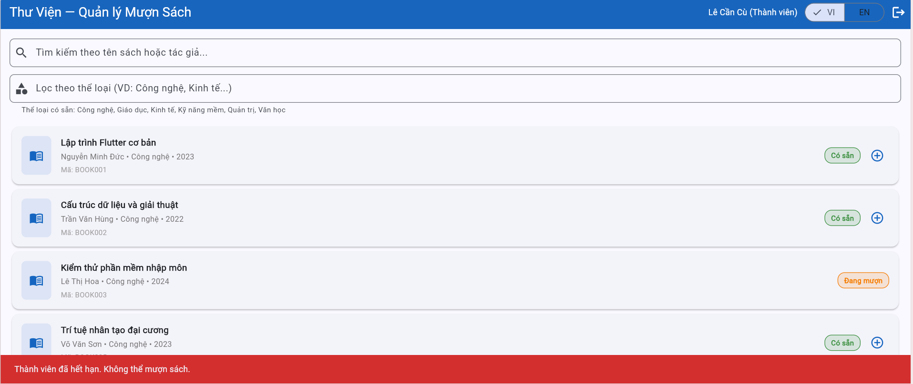
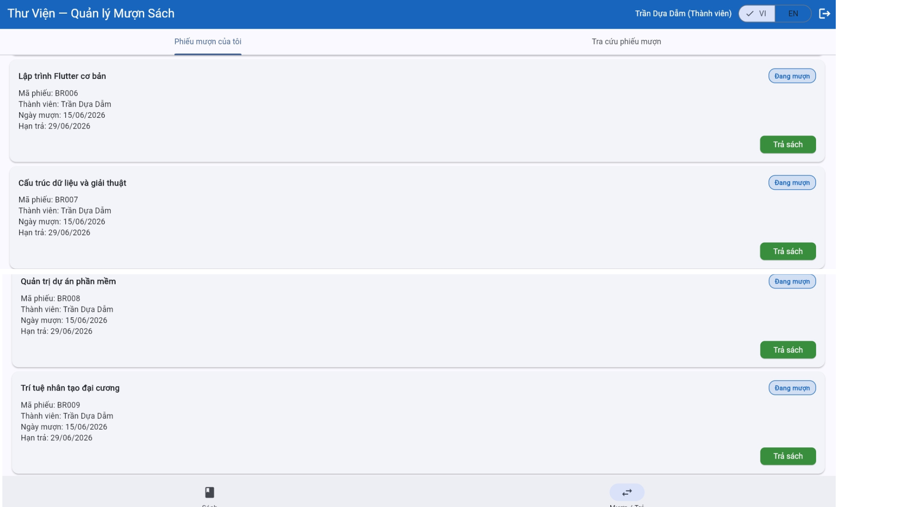
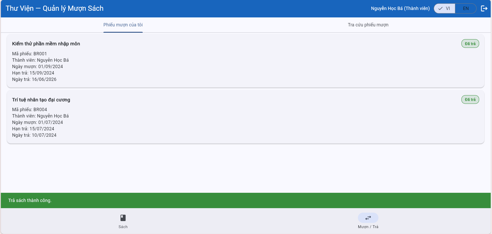
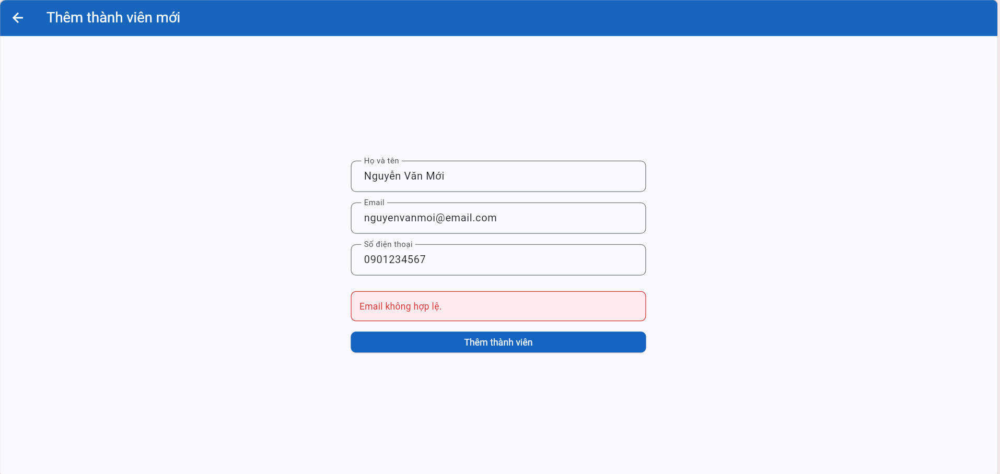
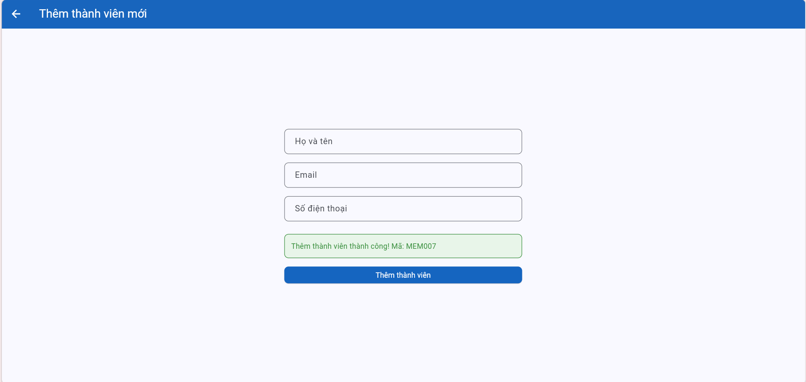
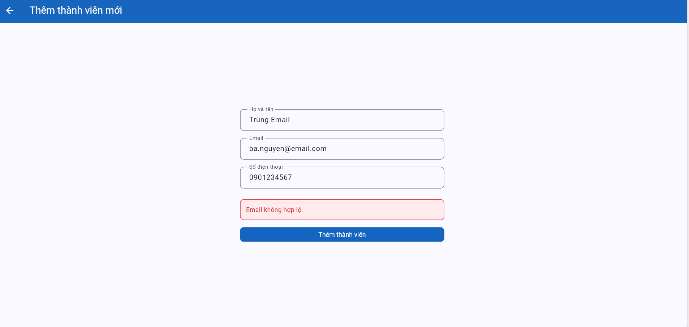
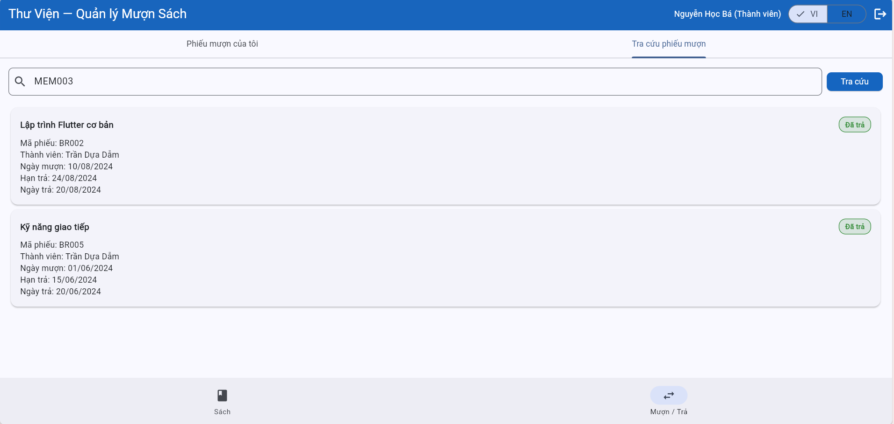
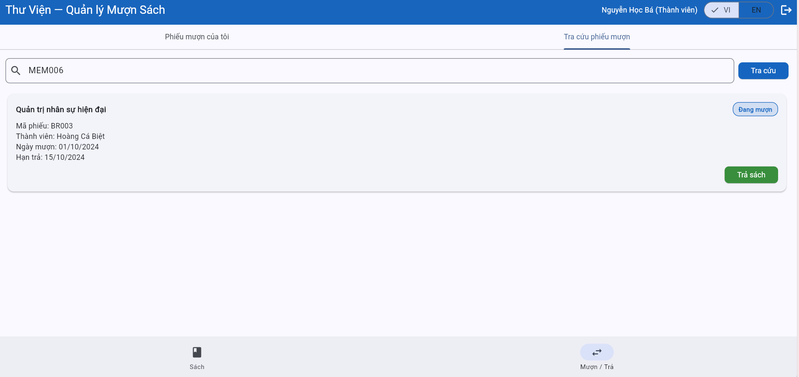
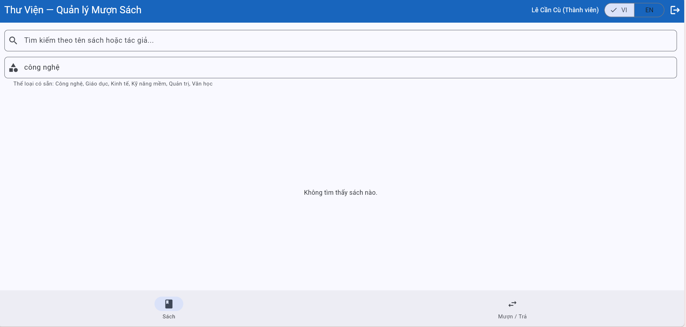
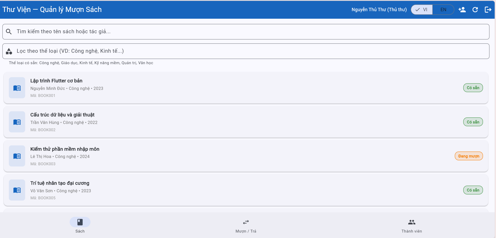

# Test Execution — Test Execution Results

> **Instructions**: Run each TC on the system https://stqa.rbc.vn and record actual results.
> Conclusion: **Pass** (result matches), **Fail** (result differs → create bug report), **Blocked** (cannot execute due to another bug blocking), **Not Run** (not yet executed).

| Information | |
|---|---|
| **Team** | Group 11 |
| **Execution Date** | 06/06/2026 |
| **Browser** | Chrome (latest version) |
| **Operating System** | Windows 11 |

---

## Detailed Results

| TC ID | Feature Group | Expected Result (summary) | Actual Result | Conclusion | Screenshot | Bug |
|-------|---------------|---------------------------|-----------------|---------|------------|----|
| TC-01 | Login | Login successful, AppBar displays name + Librarian role | Redirected to home page. AppBar displays "Nguyen Thu Thu — Librarian" | Pass | | |
| TC-02 | Login | Error message "Member not found" | Displays message "Member not found" | Pass | | |
| TC-03 | Login | Error message "Incorrect password" | Displays message "Incorrect password" | Pass | | |
| TC-04 | Login | Error message "Please enter email and password" | Displays message "Please enter email and password" | Pass | | |
| TC-05 | View Books | Both roles can view 20 books with full information | Both roles view all 20 books, each showing: title, author, genre, publication year, status | Pass | | |
| TC-06 | View Books | BOOK001 changes to "Borrowed" after borrowing, real-time | Displays status "Borrowed" immediately after borrowing, no refresh needed | Pass | | |
| TC-07 | Search | Shows BOOK001 when searching "Flutter" | Shows BOOK001 "Lap trinh Flutter co ban" | Pass | | |
| TC-08 | Search | Shows BOOK001 + BOOK009 when searching "Nguyen Minh Duc" | Shows BOOK001 + BOOK009 (2 books by author Nguyen Minh Duc) | Pass | | |
| TC-09 | Search | Empty list, message "No books found" | Shows message "No books found" when entering a non-existent keyword | Pass | | |
| TC-10 | Search | "flutter" and "FLUTTER" produce same results as "Flutter" | Both display identical results — case-insensitive search works correctly | Pass | | |
| TC-11 | Filter Books | Shows 8 Technology genre books | Displays all **8** Technology genre books | Pass | | |
| TC-12 | Borrow Book | Borrow BOOK004 successful, new record created, due date +14 days | Borrow successful, new record created, due date = borrow date + 14 days (year 2026 correct) | Pass | | |
| TC-13 | Borrow Book | Reject borrowing BOOK003 (currently borrowed), no borrow button | No borrow button on "Borrowed" book | Pass | | |
| TC-14 | Borrow Book | Reject borrowing BOOK007 (Lost), no borrow button | No borrow button on "Lost" book | Pass | | |
| TC-15 | Borrow Book | Reject MEM004 (Suspended), message contains "suspended" | Rejects borrowing but displays **"Member has expired. Cannot borrow books."** instead of "suspended" | **Fail** |  | BUG-02 |
| TC-16 | Borrow Book | Reject MEM005 (Expired), message contains "expired" | Rejects borrowing, displays **"Member has expired. Cannot borrow books."** — correct per SRS | Pass | | |
| TC-17 | Borrow Book | Steps 1-3: borrow successful; Step 4: rejected, 3-book limit | Steps 1-3: borrow successful. Step 4: borrowing 4th book **still succeeds**, not rejected — member currently borrowing 4 books | **Fail** |  | BUG-01 |
| TC-18 | Return Book | Return BOOK013 successful, book → "Available", no warning | Return successful, BOOK013 → "Available", no overdue warning (book not overdue) | Pass | | |
| TC-19 | Return Book | Overdue warning when returning BOOK003 (BR001) | Return successful, BOOK003 → "Available". **No overdue warning displayed** | **Fail** |  | — *(unimplemented)* |
| TC-20 | Overdue | BR001 + BR003 marked "Overdue" after Librarian clicks check | BR001 and BR003 both marked "Overdue" (correct: both have dueDate ≤ today) | Pass | | |
| TC-21 | Overdue | MEM002 sees BR001 overdue, does not see other members' records | MEM002 sees BR001 "Overdue", default tab shows only own records | Pass | | |
| TC-22 | Member Management | Create new member successfully (valid email) | Valid email `nguyenvanmoi@email.com` rejected with message **"Invalid email"** | **Fail** |  | BUG-03 |
| TC-23 | Member Management | Error for invalid email (`user@domain` missing dot in domain) | Invalid email `user@domain` (missing `.` in domain) **accepted**, member created successfully | **Fail** |  | BUG-04 |
| TC-24 | Member Management | Error for existing email, message "Email already exists" | Rejected but shows wrong message **"Invalid email"** instead of "Email already exists" | **Fail** |  | BUG-05 |
| TC-25 | Borrow Records | Librarian views all 5 records BR001–BR005 | Displays all 5 records: BR001, BR003 "Borrowing"; BR002, BR004, BR005 "Returned" | Pass | | |
| TC-26 | Borrow Records | MEM002 only sees BR001 + BR004 (own records) | Only sees BR001 and BR004, does not see other members' records in default tab | Pass | | |
| TC-27 | Borrow Records | MEM002 cannot view records of MEM003/MEM006 | MEM002 **can view** records of MEM003 (BR002, BR005) and MEM006 (BR003) when entering member ID — violates REQ-08 | **Fail** |   | BUG-06 |
| TC-28 | Filter Books | "technology" (lowercase) produces same results as "Technology" | Filtering "technology" (lowercase) returns **"No books found"** — 0 results. Filter is case-sensitive | **Fail** |  | BUG-07 |

---

## Important Notes

### Note 1: TC-15/TC-16 — Adjusted Execution Method

SRS requires the Librarian to have the right to "borrow books for members" (SRS Section 1). However, the system **does not display a Borrow button** when logged in as Librarian — this feature is not yet implemented (unimplemented feature). Therefore, TC-15 and TC-16 were executed by **logging in directly with the member account** (MEM004/MEM005) instead of through the Librarian.

**Evidence:**

This execution method is still valid because:
- SRS REQ-01 only checks email + password for login — does not require checking member status at the login step.
- SRS REQ-04 specifies that borrow rejection applies at the **borrowing step** — regardless of who performs the action (member borrowing directly or Librarian borrowing on their behalf).

### Note 2: TC-19 — Unimplemented Feature

SRS REQ-05 requires displaying an overdue warning when returning an overdue book, but the system does not display any warning. Further confirmation: BR001 **is correctly marked "Overdue"**, but when clicking **Return** → no dialog/warning appears, the return completes immediately.

This is an **unimplemented feature**, not a code bug. TC-19 records Fail because the actual result does not match SRS, but **no bug report is created**.

**Evidence:**

### Note 3: Additional Finding — Unimplemented Feature

When logged in as Librarian, the "Books" tab **does not display a Borrow button** on any book. The Librarian also **cannot create a borrow record** for a member from the "Borrow / Return" tab. Per SRS Section 1: the Librarian must have the right to "borrow/return books for members" → This is an **unimplemented feature**, not a code bug.

**Evidence:**

---

## Summary of Results

| Metric | Value |
|--------|---------|
| Total test cases | 28 |
| Pass | 20 |
| Fail (bug) | 7 |
| Fail (unimplemented feature — no bug report) | 1 (TC-19) |
| Blocked | 0 |
| Not Run | 0 |
| **Pass Rate** | **71.4%** |
| **Bugs Detected** | **7** |

### Results by Feature Group

| Feature Group | Total TC | Pass | Fail | Pass Rate |
|---------------|----------|------|------|------------|
| Login (REQ-01) | 4 | 4 | 0 | 100% |
| View Books (REQ-02) | 2 | 2 | 0 | 100% |
| Search & Filter (REQ-03) | 6 | 5 | 1 | 83.3% |
| Borrow Book (REQ-04) | 6 | 4 | 2 | 66.7% |
| Return Book (REQ-05) | 2 | 1 | 1* | 50% |
| Overdue Handling (REQ-06) | 2 | 2 | 0 | 100% |
| Member Management (REQ-07) | 3 | 0 | 3 | 0% |
| Borrow Records (REQ-08) | 3 | 2 | 1 | 66.7% |

> *\* TC-19 Fail due to unimplemented feature, not a code bug.*
